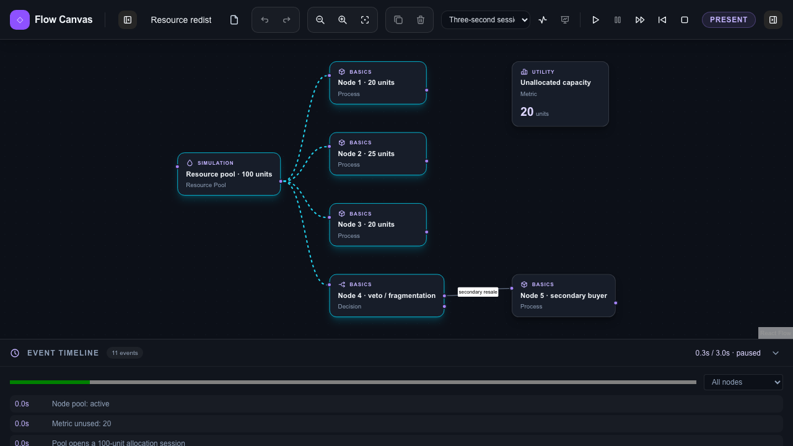

# Flow Canvas

An open-source, local-first visualizer template for connected systems and scripted simulations. Model a system with reusable modules, replay its changing state, and present the story on one canvas. This repository is standalone; it does not connect to Coalition, Arch, or any live blockchain yet.



## Try it

Use Node.js 22 and npm 10:

```bash
npm ci
npm run dev
```

Open [localhost:3000](http://localhost:3000) for the example gallery, or [localhost:3000/studio](http://localhost:3000/studio) for the editor. A fresh studio opens the API lifecycle example; saved local work takes priority. Choose “Start blank” for an empty canvas. Selecting an example over saved work requires confirmation.

The three built-in, editable scripted demos are API lifecycle, parallel agent research, and resource redistribution. The last follows one resource pool, four initial recipients, a Node 4 veto and fragmentation, and a resale to Node 5. Each has a three-second timeline and is expressly a simulation—not a live transaction.

## What is included

- Module palette, searchable sidebar, editable React Flow canvas, typed connections, property inspector, undo/redo and keyboard shortcuts.
- Deterministic scenario playback with pause, step, restart, textual status, event timeline and presentation mode.
- Local autosave plus validated JSON import/export. Documents remain in your browser unless you export them; no account or server database is required.
- A module registry and presentation map for extensions without changing the graph core or canvas switch logic.
- Unit/integration tests, production-backed Playwright browser checks, axe accessibility checks, visual baselines and CI.

## Verify

```bash
npm run verify
npm run test:coverage
npx playwright install chromium
npm run test:e2e -- --project=chromium
```

`verify` runs formatting, lint, TypeScript, architecture boundaries, unit/integration tests and a production build. The screenshot baselines are reviewed on macOS Chromium and skipped on other operating systems; functional browser tests run everywhere. Firefox and WebKit are available as Playwright projects for release checks after installing their browsers.

## Extend it

Start with the [architecture](docs/architecture.md) and [module/scenario extension guide](docs/extensions.md). The [implementation guide](docs/implementation.md), [progress ledger](docs/progress.md), and [release checklist](docs/release.md) record the ordered test-first development and checks. For a contribution, see [CONTRIBUTING.md](CONTRIBUTING.md).

Flow Canvas is [MIT licensed](LICENSE). Third-party packages retain their own licenses; see [notices](THIRD_PARTY_NOTICES.md). The built-in examples are for demonstration and make no claim about real resource allocation or blockchain finality.
